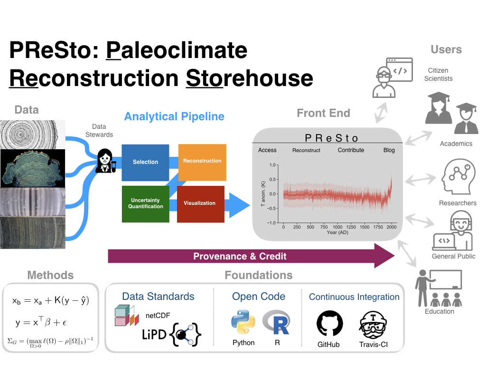

# Paleoclimate Reconstruction Storehouse

Paleoclimate reconstructions are among the most widely used scientific products from the paleoclimate community. They constitute statistical inference based on thousands of field and laboratory measurements: a single chart like the “Hockey Stick” temperature reconstruction of the past 1,000 years synthesizes what is known about past climate variations in a form that is easily digestible within and beyond the geosciences: in climate science of course, but also the paleogeosciences at large, and even in the social and life sciences. However, such reconstructions are infrequently updated and commonly lag many years behind the latest data and methods. Until recently, the lack of a central clearinghouse also made them difficult to find. Finally, paleoclimate reconstructions involve potentially many subjective  choices that have not been exhaustively explored, and are opaque to most users. Enter the Paleoclimate Reconstruction “Storehouse” (PReSto), an [NSF-funded project](https://www.google.com/url?sa=t&rct=j&q=&esrc=s&source=web&cd=&ved=2ahUKEwj65fKj3Z_zAhXX3J4KHffNCxAQFnoECAUQAQ&url=https%3A%2F%2Fwww.nsf.gov%2Fawardsearch%2FshowAward%3FAWD_ID%3D1948746%26HistoricalAwards%3Dfalse&usg=AOvVaw0Qvq1Jr62E-6W1TCX_9Tg5) which will:

1. Draw from the most up-to-date, curated paleoclimate data compilations;
2. Apply an array of published methods to produce continuously-updated reconstructions; and
3. Provide broad access via a responsive web front end, allowing to easily visualize, download and compare published reconstructions, investigate unexplored combinations of data and methods, and generally lower friction to develop or use paleoclimate reconstructions.

## Key Components

### Data

We have developed [lipdverse.org](https://lipdverse.org) as a simple source of version controlled paleoclimate datasets that supply data to PReSto reconstruction algorithms. lipdverse is open access and broadly useful beyond the PReSto project, contributing to data and methodological transparency and open science.

#### Recommender system
We developed a [recommender system](https://paleorec.readthedocs.io/en/latest/index.html) to help standardize paleoclimate datasets. This system is now implemented on the [LiPD playground](https://lipd.net/playground), where it helps standardize the paleoData part of a LiPD file. A similar system for the ChronData part is under development.

### Analytical pipelines

We are building analytical pipelines that automatically update reconstructions for a handful of test cases. Starting with:

1. Data assimilation for the Common Era ([code](https://fzhu2e.github.io/LMRt/))
2. Reconstructions of Holocene Temperature variability

Details, codebases and results for these pipelines will be updated as they come online.

### Front End

A web-based front end that provides ready access to reconstructions and data visualization is under development. Stay tuned.

### Education and outreach

Later in the project, we're planning workshops to train data stewards to properly digitize and describe paleoclimate datasets for applications such as PReSto and trainings for early-career researchers to use this cyberinfrastructure to further their scientific objectives. Furthermore, we're working to develop resources for K-12 and tribal college teachers in Northern Arizona, and design and offer one-day educational workshops for teachers throughout the region. The workshop will be centered around familiarizing teachers with PReSto, including how to use the platform to explore case-studies that place key historical junctures in the context of environmental change.
